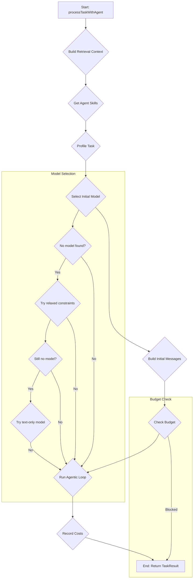
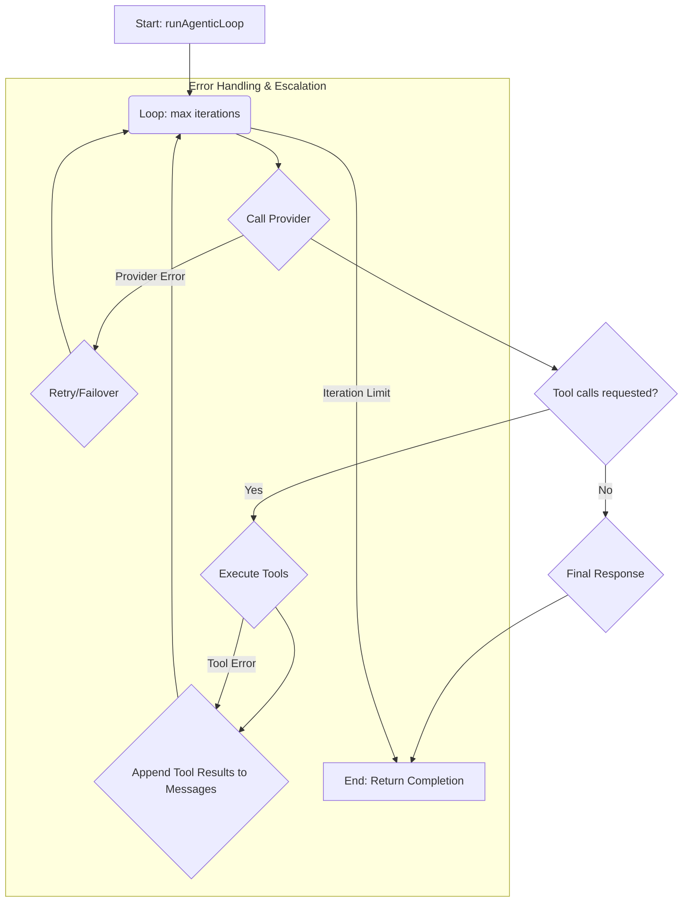

# Orchestrator Internal Flow

This document details the internal logic of the `Orchestrator` service, focusing on the `processTaskWithAgent` and `runAgenticLoop` methods.

## `processTaskWithAgent`

This method is the entry point for executing a task with a pre-selected agent.

### Key Logic:

1.  **Context and Skills:** Gathers relevant information from memory and the skills available to the agent.
2.  **Model Selection:**
    *   Selects the best model based on routing constraints, allowed models for the agent, and the task profile.
    *   Has a multi-step fallback mechanism if no model is initially found, first relaxing constraints, then trying to find a text-only model if no tool-capable model is available.
3.  **Budget Check:** Before executing the main loop, it checks if the estimated cost of the request exceeds the daily budget.
4.  **Agentic Loop:** Delegates to `runAgenticLoop` for the core execution.
5.  **Cost Tracking:** Records the final cost of the operation.

## `runAgenticLoop`

This method implements the multi-turn tool-use loop.

### Key Logic:

1.  **Iteration Loop:** The loop continues until the model returns a final text response or the maximum number of iterations is reached.
2.  **Provider Call:** Calls the selected LLM provider with the current message history and available tools.
3.  **Tool Execution:**
    *   If the model requests tool calls, the orchestrator executes them in parallel.
    *   It handles tool approval, checkpointing for write operations, and post-tool verification.
    *   It can also synthesize new skills on-the-fly if the model calls a tool that doesn't exist.
4.  **Message History:** The results of the tool calls are appended to the message history, and the loop continues.
5.  **Model Escalation:** If the model is struggling to complete the task (e.g., repeated tool failures), the orchestrator can escalate to a more powerful model.
6.  **Error Handling:** It includes robust error handling for provider failures, with retries and failovers to different models or providers.

This flow allows the system to handle complex, multi-step tasks by breaking them down into a series of tool calls and reasoning steps, with safeguards and fallbacks to ensure resilience.
