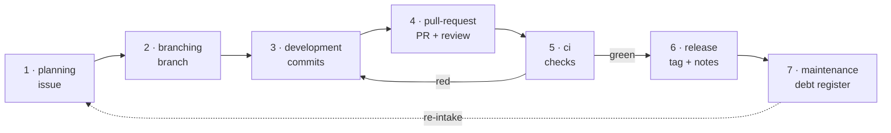

# The Guided GitHub Workflow

**The canonical workflow specification for AtlasMind.**

This document defines the single guided workflow AtlasMind uses for project
management, development, testing, continuous integration, releases, and
maintenance. It is the default and recommended workflow for solo developers and
for small studios of three to ten people working on GitHub.

---

## §0 Status and scope

### 0.1 Normative language

- **MUST** — required. A conforming implementation cannot omit it.
- **SHOULD** — strongly recommended. Deviation requires a stated reason.
- **MAY** — optional, at the team's discretion.

### 0.2 Built versus proposed

AtlasMind ships parts of this workflow today and does not ship others. Every
subsection describing capability that is **not yet built** carries a literal line:

> `Status: proposed — see project_memory/roadmap/guided-github-workflow.md`

That marker is greppable on purpose. A reader must never have to guess whether a
paragraph describes behaviour they can rely on right now. Where a capability is
partly built, the marker names precisely which half is missing.

### 0.3 Conformance

A project conforms to this specification when its workflow configuration
(§4) declares all eight stages, when every stage names an owning agent that
resolves in the agent registry, and when no stage's effective automation level
exceeds the ceiling defined in §5.

AtlasMind's own repository is a conforming instance. Its declared values —
branch names, label taxonomy, required checks, release secrets — live in
[`github-workflow.md`](github-workflow.md), which states *values only* and never
restates a rule from this document.

### 0.4 Non-goals

This is not a git tutorial, not a GitHub Actions reference, and not a
methodology argument. It does not attempt to be the only workflow a team could
use; it aims to be a good one that AtlasMind can guide, measure, and enforce
deterministically.

---

## §1 Why one workflow

A workflow that exists only as prose drifts. AtlasMind's own repository proves
it: before this specification, nine documents described the project's GitHub
process and they disagreed with each other on whether pull requests target
`main` or `develop`, whether reviews are required, and whether a release is
driven from the Actions tab or from a developer's terminal. Two cited CI
workflow files that do not exist. Six asserted that a directory was excluded
from the release branch when ninety of its files were tracked there.

None of those were carelessness. They were the predictable result of the same
rule being restated in nine places, each edited at a different time.

This specification takes a different position:

> **A workflow is data, not prose.**

The stages, their gates, their automation levels, and their owners live in a
single committed configuration file (§4). This document defines what that data
*means*. Every other document in a conforming project points here and may name a
value, but may never restate a rule.

The practical consequences:

- **Deterministic.** Given the same inputs, a stage produces the same output. Where a step cannot be deterministic — an LLM decomposing a goal into subtasks — this specification says so explicitly rather than implying a guarantee it cannot keep.
- **Reproducible.** Every stage transition is recorded with a fingerprint of its inputs and outputs, so two runs can be compared rather than trusted.
- **Enforceable.** Gates are evaluated before an action, not asserted afterwards in a review checklist.
- **Teachable.** Because the stages are data, AtlasMind can render them as a guided surface with per-step explanation, which is what the Workflow page of the Project Dashboard does.

---

## §2 Guided Workflow Overview

### 2.1 The eight stages

| # | Stage id | Name | One line |
|---|---|---|---|
| 1 | `planning` | Planning & Issue Intake | Turn an intention into a tracked, labelled issue with acceptance criteria. |
| 2 | `branching` | Branch Creation & Naming | Derive a conventional branch name from that issue and create it from the integration branch. |
| 3 | `development` | Local Development & Multi-Agent Orchestration | Do the work, with agents decomposing and executing against the project's testing protocols. |
| 4 | `pull-request` | Pull Requests & Reviews | Open a pull request that links its issue, fills the template, and collects review. |
| 5 | `ci` | CI/CD Integration & Failure Analysis | Watch the checks, and when they fail, classify why with evidence. |
| 6 | `release` | Release Automation | Bump the version, write the changelog, tag, and publish. |
| 7 | `maintenance` | Maintenance & Tech-Debt | Keep the register of what was deferred, and age it visibly. |
| 8 | `automation` | AI-Driven Automation Layer | The policy engine that decides how much of the above AtlasMind may do unattended. |

Stage 8 is not a step you perform. It is the layer the other seven run inside.

### 2.2 The stage spine



The loop from `ci` back to `development` is the normal case, not the exception.
The dotted line from `maintenance` to `planning` is how deferred work re-enters
the workflow as a tracked issue rather than as a comment nobody reads.

### 2.3 The three invariants

Every stage MUST satisfy all three. They are inherited from AtlasMind's existing
guarded promotion engine, where they have already survived contact with a real
release process.

**I1 — Deny by default.**
Every stage ships at automation level `observe`. Every capability that writes to
GitHub ships disabled. A workflow that arrived helpfully pre-authorised would
remove the property the authorisation exists to provide.

**I2 — Server-sourced commands.**
A user interface MAY trigger a stage and MAY attest that a manual check was
performed. It MUST NOT supply a command string. Every command AtlasMind executes
originates from a constant in source or from persisted, user-authored
configuration. This is what keeps a webview message from becoming a shell.

**I3 — Append-only audit.**
Every stage transition is recorded before it acts, with the actor (human or
agent), the requested and effective automation level, and the gate results. The
record is append-only. A stage that cannot write its record MUST NOT proceed.

---

## §3 The eight stages — normative contracts

Every stage below uses the same eight fields, in the same order, so they can be
compared and so a reader learns the shape once.

---

### §3.1 Stage 1 — Planning & Issue Intake (`planning`)

**Trigger.** A roadmap item selected for work; an idea captured in chat; a
maintenance finding promoted from stage 7; or an issue opened by someone else.

**Inputs.** The roadmap backlog and its declared release gates; SSOT project
memory; the repository's issue templates; the open issue set; the label taxonomy
declared in the workflow configuration.

**Owning agent.** `github-operator` owns the GitHub interaction. Decomposition is
performed by the **Planner service**, not by an agent — it is a service in
`src/core/planner.ts`, and this specification deliberately does not invent a
"planner agent" that does not exist.

**GitHub surface.**

| Operation | Command | Built |
|---|---|---|
| Resolve repository | `gh repo view --json nameWithOwner` | ✅ |
| Read issues | `gh issue list --json number,title,state,author,labels,assignees,body,url,createdAt,updatedAt,comments` | ✅ |
| Create | `gh issue create --title --body --label` | ✅ |
| Comment | `gh issue comment <n> --body` | ✅ |
| Close / reopen | `gh issue close <n>` · `gh issue reopen <n>` | ✅ |
| Edit, assign, milestone | `gh issue edit <n> --add-assignee --milestone` | *Status: proposed* |

**Deterministic outputs.**

An `IssueDraft { title, body, labels[] }` where:

- `title` is a pure derivation of the source item — no model rewrites it.
- `labels` are drawn **only** from the declared taxonomy. A label that does not match the taxonomy is **dropped, never invented**. This matters: a workflow that invents labels silently fragments a team's filters.
- `body` is a fixed-order template render. The source text is fenced and marked as untrusted reported content.
- Same input plus same taxonomy ⇒ **byte-identical draft**.

Plus an `IntakeSummary` — open, unassigned, and stale counts, where stale means
untouched for more than the declared threshold (30 days by default).

**Gates and blockers.**

- Repository slug unresolvable ⇒ **blocked**. Everything downstream depends on it.
- Normalised-title collision with an open issue ⇒ **blocked pending explicit confirmation**. Duplicate issues are the most common intake failure.
- Body exceeding the declared cap ⇒ truncated at a declared boundary **with a visible marker**, never silently.
- Draft containing a secret-shaped token ⇒ **blocked**. Not redacted — blocked. A silently redacted issue means someone believes they published something they did not.

**Automation rung.** Default `observe`. `draft` is the recommended first opt-in.
Any write requires `propose` at minimum and inherits the modal confirmation that
names the repository and the exact action.

---

### §3.2 Stage 2 — Branch Creation & Naming (`branching`)

**Trigger.** An issue accepted for work.

**Inputs.** Issue number and title; the naming convention from the workflow
configuration; the current base branch and working-tree state; the protected
branch set.

**Owning agent.** `github-operator`.

**GitHub surface.** Naming requires **none** — it is a pure function. Creation
uses local git. `gh api repos/{slug}/branches/{base}/protection` confirms the
base permits the operation. ✅ built.

**Deterministic outputs.**

`deriveBranchName({ type, issueNumber, title, convention })` → e.g.
`feat/142-guided-github-workflow`.

The function MUST be:

- **Pure and idempotent** — same inputs, same name, every time.
- **ASCII-slugged** — Unicode transliterated or dropped, never passed through.
- **Length-capped** at the configured maximum, truncated at a word boundary.
- **Lowercase**, with a single separator character between words.
- **Collision-resolved by a deterministic ordinal suffix** (`-2`, `-3`) — never a hash, never a timestamp. A developer who runs the same command twice must get a name they can predict.

It MUST reject the character set already rejected by AtlasMind's branch skills
(`~ ^ : whitespace \ ..`) and MUST NOT be capable of producing a name in the
protected set (`main`, `master`, `production`, `prod`, `release`, `stable`) or
matching `release/*` or `hotfix/*`.

**Gates and blockers.**

- Base branch has uncommitted changes ⇒ **blocked**.
- Name already exists on the remote ⇒ **blocked**. Never force, never overwrite.
- Slug empty after sanitisation ⇒ **blocked**, and AtlasMind asks for a name. It MUST NOT fall back to a generated identifier — an unreadable branch name is worse than a question.

**Automation rung.** Default `draft` — show the derived name. `propose` to
create it. `auto` permitted only when the base is unprotected.

---

### §3.3 Stage 3 — Local Development & Multi-Agent Orchestration (`development`)

**Trigger.** Work begins on the branch.

**Inputs.** The issue body (**untrusted**); SSOT project memory; the project
testing configuration; the Planner's fixed role vocabulary.

**Owning agent.** None singly. The **Orchestrator service** owns the stage;
role-selected specialists own individual subtasks.

**GitHub surface.** **None. Deliberately.**

This is worth stating plainly rather than leaving as an omission. Stage 3 is
where the work happens, and it touches the working tree, the model router, and
project memory — but it does not touch GitHub. Keeping it GitHub-free is what
lets a developer work offline, and it prevents this specification from implying
a handoff or pull-request capability at a point where none exists.

**Deterministic outputs.**

This stage requires the most careful honesty in the whole specification.

**What is deterministic:**

- **Scheduling.** Subtask batching is a topological sort over the dependency graph, and is order-stable for a given graph.
- **Testing methodology assignment.** Mapping a subtask to an enabled methodology is a pure function of the subtask text and the enabled set.
- **Recording.** Every run writes a run-history record.

**What is not deterministic:**

- **The decomposition itself.** A language model turns a goal into a subtask graph. Two runs of the same goal can produce different graphs. This specification does not claim otherwise, and any surface that displays a plan MUST NOT present it as reproducible.

The determinism contract for stage 3 is therefore over *scheduling, assignment,
and recording* — not over the plan.

**Gates and blockers.** The Mission Loop's deny-by-default checkpoints: every N
iterations, on crossing a budget fraction, and before a batch of writes. A
checkpoint that is never answered **denies**. Guarded delivery is never invoked
directly from this stage. The bounded envelope — cost, iterations, tokens,
wall-clock, no-progress — closes the loop.

**Automation rung.** Governed by the existing Mission Loop settings, **not** by
the workflow ladder. The workflow configuration references those settings; it
MUST NOT duplicate or override them. Two switches for one decision is how a
guardrail gets left on in one place and off in the other.

---

### §3.4 Stage 4 — Pull Requests & Reviews (`pull-request`)

**Trigger.** The branch is pushed and the stage is enabled.

**Inputs.** Head and base branch; the commit range; the linked issue; the pull
request template; the code-owners file; the profile's approver policy.

**Owning agent.** `github-operator` for mechanics; `code-reviewer` and
`security-reviewer` for the review pass.

**GitHub surface.**

> **Built as of v0.183.0.** Every operation in this table was net-new when this
> specification was written — AtlasMind had no pull-request code at all, no type,
> no call, no sanitizer. Reading landed in v0.182.0 and writing in v0.183.0, each
> write behind the automation ladder and a confirmation naming the repository and
> the exact action. `pullRequestTracker.ts` is the untrusted-input boundary.

| Operation | Command |
|---|---|
| Create | `gh pr create --base --head --title --body` |
| List | `gh pr list --json number,title,state,headRefName,createdAt,mergedAt,reviews` |
| View / diff | `gh pr view --json` · `gh pr diff` |
| Review | `gh pr review --approve` · `--request-changes` · `--comment` |
| Review threads | `gh api repos/{slug}/pulls/{n}/reviews` · `.../comments` |
| Checks | `gh pr checks` |

**Deterministic outputs.**

A `PullRequestDraft { title, body, labels[], linkedIssue }` where:

- `title` derives from the **conventional-commit classification of the commit range**, reusing the existing bump classifier rather than adding a second commit parser. Two parsers of the same format eventually disagree.
- `body` is a fixed-order fill of the repository's pull request template.
- Same commit range plus same template ⇒ **byte-identical draft**.
- Review findings are emitted as structured records `{ path, line, severity, ruleId }` — never free prose pasted into a pull request.

**Gates and blockers.**

- Base is protected **and** protected-ref writes are disabled ⇒ `auto` is unreachable for this stage. Not "discouraged" — unreachable.
- A linked issue is required by configuration and none is present ⇒ **blocked**.
- The template checklist is unfilled ⇒ **blocked**.
- The studio profile requires distinct approvers and too few are present ⇒ **blocked**.
- **Incoming review comments are untrusted input.** A reviewer — or anyone who can comment — can write text designed to be read as an instruction. Review bodies MUST be sanitized, control-stripped, secret-redacted, length-capped, and fenced as reported content before reaching any prompt. This is the workflow's primary prompt-injection surface.

**Automation rung.** Default `draft`.

**This stage carries the largest solo/studio difference in the specification:**
the solo profile requires **zero** approvals; the studio profile requires **at
least one approver distinct from the author**. Everything else about the two
profiles is a matter of degree. This one is a matter of kind.

---

### §3.5 Stage 5 — CI/CD Integration & Failure Analysis (`ci`)

**Trigger.** A head commit acquires check runs. Polled on demand, never on a
timer that spends a rate limit nobody asked to spend.

**Inputs.** The head commit; the workflow definitions; check-run states; test
report artifacts.

**Owning agent.** `ci-analyst`. **Built in v0.184.0**, routing-neutral as
specified below.

**GitHub surface.**

| Operation | Command | Built |
|---|---|---|
| Check-run states | `gh api repos/{slug}/commits/{ref}/check-runs` | ✅ |
| Branch protection contexts | `gh api repos/{slug}/branches/{b}/protection` | ✅ |
| Run list | `gh run list --json` | *proposed* |
| Job breakdown | `gh api repos/{slug}/actions/runs/{id}/jobs` | *proposed* |
| **Failed logs** | `gh run view <id> --log-failed` | *proposed* |

AtlasMind reads check **states** today and has never read a **log**. That is the
difference between knowing a job failed and knowing why.

**Deterministic outputs.**

A `CiFailureReport { runId, jobName, stepName, classification, evidenceLines[], suggestedOwnerAgentId }`.

`classification` comes from an **ordered, first-match-wins rule table over the
log text**, published here so a reader can predict it:

| Order | Classification | Matches |
|---|---|---|
| 1 | `dependency-install` | package-manager resolution and lockfile failures |
| 2 | `compile` | type errors, build failures |
| 3 | `lint` | linter and formatter violations |
| 4 | `test-failure` | assertion and suite failures |
| 5 | `timeout` | job or step exceeded its limit |
| 6 | `flake-suspect` | the same job passed on retry, or failed non-deterministically in the window |
| 7 | `infra` | runner, network, or registry unavailability |
| 8 | `unknown` | nothing matched |

**No model participates in classification.** Same log bytes ⇒ same
classification. That is the whole point: a failure taxonomy that varies run to
run cannot be charted, and a chart of CI failures is one of the most useful
things a team can look at.

Where a JUnit-format report exists, the existing report parser supplies counts,
and inherits its contract **verbatim**:

- **No report ⇒ no verdict.** Never "0 failing". A test suite that did not run is not a test suite that passed, and conflating the two is how a green dashboard hides a broken pipeline.
- Failure **messages** are deliberately not extracted — assertion text routinely contains environment values.

**Gates and blockers.**

- Logs are untrusted: size-capped, control-stripped, and secret-redacted before display or prompt.
- `unknown` classification ⇒ **escalate to a human**. Never guess. A confidently wrong root cause costs more than an honest "I don't know".
- **No automatic job re-run at any rung.** Re-running a job to see if it passes this time is how a flake becomes policy.
- **No automatic edit of a workflow file at any rung.** A workflow file is the thing that enforces the gates; an agent that can edit it can remove them.

**Automation rung.** Default `observe` — which is exactly what ships today.
`draft` produces the report. `propose` posts it as a pull-request comment.
**`auto` is out of scope for version 1.**

---

### §3.6 Stage 6 — Release Automation (`release`)

**Trigger.** A promotion from the integration stage to the production stage.

**Inputs.** The commit range since the last tag; the current version; the
changelog; the target stage's promotion policy.

**Owning agent.** `release-manager`, delegating mechanics to `github-operator`
and pipeline configuration to `devops-engineer`.

> **Built in v0.184.0**, routing-neutral as specified below. The stage's
> deterministic half does not need it: preparation is a rule-driven plan, and an
> agent's role here is to explain a blocked gate, never to decide one.

**GitHub surface.** `gh release list --json tagName,publishedAt,isPrerelease,isDraft` ✅
(read, on explicit refresh). `gh release create <tag> --notes-file --title` and
`gh release view` *proposed* — note that release creation already happens in CI
for AtlasMind's repository, so the capability exists at the pipeline layer.

**Deterministic outputs.**

This stage is the **best-served by existing code** of any in the specification.
The following are already pure, already exported, already tested, and MUST be
reused rather than reimplemented:

1. Classify the bump from conventional commits over the range → `major` | `minor` | `patch`.
2. Apply the bump to the current version.
3. Write the version back, preserving file formatting.
4. Insert a changelog entry in Keep a Changelog format.
5. Guard monotonicity with a semantic-version comparison.

**Release notes are the changelog section for that version, verbatim.**

They MUST NOT be generated by a language model. This is a rule, not a
preference. A release note is a durable public claim about what changed; the
changelog is the reviewed artifact where that claim was already made. Generating
a second, differently-worded description invites the two to disagree, and the
one users read would be the unreviewed one.

The tag is `v<version>`, created idempotently.

**Gates and blockers.**

The five ordered gates of the existing promotion engine are inherited unchanged:

1. No blockers.
2. No failing automatic check.
3. Every manual check explicitly attested.
4. Approval recorded, where the target stage requires it.
5. **Type-to-confirm** on a protected target — the operator types the stage name.

Two boundaries MUST be preserved exactly as they exist today:

- Release remediation MAY edit files and make a path-scoped commit. It **never** pushes, tags, or force-pushes.
- Promotion is **single-flight** under a lock with an expiry, so two operators cannot release simultaneously.

**Release preparation gates.** Before any of the above, the stage answers whether
this version *could* be released at all. Seven gates run in a fixed order, chosen
so the first failure reported is the one closest to the root cause: changelog
entry → notes have content → no secrets in the notes → version moved on → tag is
free → working tree clean → CI passing. Being told CI is red is unhelpful when
the actual problem is that no changelog entry exists.

Each gate reports `pass`, `fail`, or `unknown`, and **`unknown` MUST NOT be
treated as a pass.** A repository whose tag list could not be read genuinely does
not know whether the tag is free, and a plan that reported it as free because it
could not check would be worse than one that reported nothing.

**A secret-shaped token in the release notes refuses the release.** It MUST NOT
be redacted out and published. This inverts the boundary rule applied to inbound
untrusted text elsewhere in this specification, deliberately: release notes are
outbound and permanent, so publishing a quietly edited version of what the author
reviewed — with no way for them to discover the edit — is the worse of the two
failures.

**The tag gate is what prevents the double publish.** An existing tag means the
publish workflow has already fired for this version. A blocked release MUST NOT
be resolved by deleting or moving the tag: anyone who already fetched it keeps
the old contents under the new name and never finds out.

**Automation rung.** `draft` is the maximum in the shipped default. **Tag and
publish stay human-triggered.**

---

### §3.7 Stage 7 — Maintenance & Tech-Debt (`maintenance`)

**Trigger.** A scheduled sweep, or on demand.

**Inputs.** The stale issue set; stale documents, from modification time against
a recorded review baseline; open dependency-update pull requests; testing policy
coverage gaps; integration drift.

**Owning agent.** `refactorer` for code debt; `dependency-manager` for
dependencies; `docs-writer` for stale documentation.

> **Partly built.** The `refactorer` agent shipped in v0.184.0. The debt register
> does not exist — `Status: proposed`, so the agent currently has nothing to
> reason over.

**GitHub surface.** `gh issue list --label`, `gh issue comment`, `gh issue close`
and `gh issue reopen` ✅; `gh pr list --author app/dependabot` *proposed*.

**Deterministic outputs.**

A `DebtRegister`, persisted as JSON with a markdown mirror, holding append-only
entries `{ id, domain, evidencePath, evidenceLine, detectedAt, severity, status }`.

- **Severity comes from a declared rule table, not a model score.** A number a model produced last Tuesday is not comparable with one it produces today, and the entire value of a debt register is that it can be sorted and aged.
- Ranking is a stable sort on `(severity, detectedAt, id)`.
- Entries **transition** — they are never deleted. A debt item that was resolved is evidence; a debt item that vanished is a gap in the record.

**Gates and blockers.**

- **Never auto-close an issue.** The existing modal confirmation stands.
- **Never auto-merge a dependency pull request.** A dependency bump is a supply-chain event.
- Debt items are **recorded**; refactors are **proposed**. No refactor is applied below the `propose` rung.

**Automation rung.** Default `observe`.

---

### §3.8 Stage 8 — AI-Driven Automation Layer (`automation`)

**Trigger.** Cross-cutting. This is the layer, not a step.

**Inputs.** Every other stage's declared inputs and outputs.

**Owning agent.** The **Orchestrator service** plus the workflow policy engine.
No agent owns the ladder — an agent that could raise its own authorisation level
is not gated.

**GitHub surface.** None of its own.

**Deterministic outputs.**

A `WorkflowRunRecord` appended to the workflow history for every stage
transition:

```
{ stageId, trigger, requestedLevel, effectiveLevel,
  inputsFingerprint, outputsFingerprint,
  gateResults[], actor: 'human' | 'agent', agentId?, timestamp }
```

**This is the determinism receipt.** It is what makes every other stage's
determinism claim *verifiable* rather than aspirational: two runs with the same
`inputsFingerprint` MUST produce the same `outputsFingerprint`, and when they do
not, the record says which stage and which run.

**Gates and blockers.** The master switch; the maximum-level ceiling; the
per-capability switch; the per-stage switch; the single-flight lock. Every rung
above `observe` requires **all** of them to permit it.

**Automation rung.** Not applicable. It *is* the ladder.

---

## §4 The workflow file — workflow as editable data

### 4.1 Location

| Path | Role |
|---|---|
| `project_memory/operations/workflow.json` | The configuration. Committed. |
| `project_memory/operations/workflow.md` | A human-readable mirror, regenerated on write. |

This follows the pattern already used for the delivery pipeline: a machine file
and a readable mirror, both tracked, so a change to how a team works shows up in
a diff.

**The file is never created implicitly.** Every other persisted document in
AtlasMind seeds itself on first read; this one MUST NOT, because it is committed.
Writing a statement about how a team works into their repository because somebody
opened a tab would be putting words in their mouth, in a file other people
review. It is created only on an explicit, confirmed action.

**A managed stage MAY be disabled; it MUST NOT be deletable.** A reader that
finds a managed stage missing restores it **disabled** rather than treating the
file as invalid. Deleting a stage by hand is therefore not an error — it simply
does not take effect, which is the intended behaviour: disabling leaves the
decision in the record, and deleting erases the evidence that it was made.

**Unknown fields MUST survive a round trip.** An older AtlasMind saving a file
written by a newer one must not silently drop the fields it does not understand.

### 4.2 Schema

```
WorkflowConfig {
  version: 1
  status: 'active' | 'specimen'
  profile: 'solo' | 'studio' | 'custom'
  updatedAt: string                          // ISO 8601
  branches: { integration, release, protected[] }
  naming:   { convention, maxLength, types[] }
  labels:   { type[], priority[], status[], area[] }
  testing:  { inherit: true }                // reads the project testing config
  stages:   WorkflowStage[]
}

WorkflowStage {
  id: 'planning' | 'branching' | 'development' | 'pull-request'
    | 'ci' | 'release' | 'maintenance' | 'automation'
  name: string
  enabled: boolean                           // default false
  automationLevel: AutomationLevel           // default 'observe'
  ownerAgentId: string                       // MUST resolve in the agent registry
  requiredChecks: string[]                   // human attestations
  requiredStatusChecks: string[]             // CI contexts
  blockers: string[]                         // declarative blocker ids
  managed: boolean                           // true = an AtlasMind guardrail
  command?: string                           // '' means "not configured" — a blocker
  testingOverrides?: { methodologyId, requiredAtStage: boolean }[]
}
```

### 4.3 Editing rules

- A **`managed: true`** stage or check MAY be **disabled**. It MUST NOT be **deleted**. Disabling is itself recorded. The distinction matters because a deleted guardrail leaves no trace that it ever existed, while a disabled one shows up in the audit record as a decision somebody made.
- **An empty `command` string IS the blocker**, not an oversight. Any stage action that requires a user-authored command ships with `''`, and that emptiness is what holds the gate shut until a human supplies a real one.
- **Unknown fields are preserved** on rewrite. A configuration written by a newer AtlasMind must survive an older one round-tripping it.
- `requiredChecks` (human attestations) and `requiredStatusChecks` (CI contexts) are **distinct and MUST NOT be collapsed**. A human saying "I checked" and a machine reporting green are different kinds of evidence.

### 4.4 Team overrides

`workflow.json` is **committed**. A team's workflow is therefore reviewed in a
pull request like any other change. That is the point: a studio that disagrees
with a default disagrees in public, with a diff and a reviewer.

**There is no per-developer override file.** A personal override would let one
developer silently disable a guardrail the team agreed to, which defeats the
model entirely. Instead:

> **The file sets intent. Settings set the ceiling.**
>
> **effective level = min(master, ceiling, capability, stage)**

Personal settings can only **lower** the effective level. A developer may run
the entire workflow at `observe` on their own machine while the repository
declares `propose`. No developer can run at `auto` if either the repository or
their own ceiling says otherwise.

> **How this is kept.** Every gating setting is read *per scope* rather than as
> the value the editor resolves. Editors resolve workspace settings above user
> settings, which is correct for a preference and wrong for a safety ceiling —
> read that way, a repository could raise the ceiling of everyone who opened it.
> The most restrictive value defined in any scope wins instead. A scope that set
> nothing does not clamp anything, so somebody with no stated preference still
> inherits their team's.
>
> Declarations are different from permissions: the profile and the archetype
> take normal precedence, because the team's answer about what the project *is*
> should win over an individual's.

**Profiles seed; they do not govern.** `solo` and `studio` are presets that
write an initial configuration. Once the file exists, the file wins. Changing
`profile` never silently rewrites stage values.

### 4.5 Migration

The configuration carries a `version`. A document written by a newer AtlasMind
is **refused, not replaced** — the distinction between *invalid* (safe to
regenerate) and *newer* (never safe to overwrite) is load-bearing, and AtlasMind
already has a shared mechanism for it.

---

## §5 The automation ladder

### 5.1 Five rungs

| Rung | AtlasMind may | AtlasMind may not |
|---|---|---|
| `off` | nothing | anything |
| `observe` | read state, compute metrics, display | produce a draft artifact |
| `draft` | produce a draft and show it | act on it |
| `propose` | act **after** an explicit confirmation | act unattended |
| `auto` | act unattended, within the stage's gates | exceed a hard ceiling (§5.6) |

### 5.2 The shipped default

**Every stage ships at `observe`.** The workflow is a guide and a set of
instruments before it is an actor. A user who never changes a setting gets a
complete, accurate, useful surface that has never written anything.

### 5.3 Capability switches

One switch per decision — never one switch for two decisions.

| Setting | Default | Governs |
|---|---|---|
| `atlasmind.workflow.enabled` | `false` | **The master off switch.** |
| `atlasmind.workflow.maxAutomationLevel` | `'observe'` | The per-user ceiling. |
| `atlasmind.workflow.allowIssueWrites` | `false` | Stage 1 and stage 7 writes. |
| `atlasmind.workflow.allowPullRequestWrites` | `false` | Stage 4 writes. |
| `atlasmind.workflow.allowReleaseWrites` | `false` | Stage 6 writes. |
| `atlasmind.workflow.allowProtectedRefWrites` | `false` | A hard ceiling — see §5.6. |

**There is no token setting, and there never will be.** AtlasMind holds no
GitHub credential. It shells to an already-authenticated `gh`, which means a
user's GitHub authorisation is managed by GitHub's own tooling, is revocable
there, and is never stored, logged, or transmitted by AtlasMind. This is a
security property worth stating rather than leaving implicit.

### 5.4 The master off switch

`atlasmind.workflow.enabled = false` reduces the effective level of every stage
to `off`, regardless of what the file or any other setting says. It is the
single control a user needs in order to be certain.

### 5.5 Precedence

```
effective(stage) = min( master, userCeiling, capabilitySwitch, stage.automationLevel )
```

Four independent gates, all defaulting closed. This is the mechanism that makes
*"full automation is possible, never default"* true **by construction** rather
than by policy. The configuration file may request `auto`; if any one of the
four disagrees, `auto` does not happen.

### 5.6 Hard ceilings

No file and no setting can raise these:

- **Writing to a protected reference** without `allowProtectedRefWrites` explicitly enabled.
- **Force-pushing.** AtlasMind force-pushes to nothing, ever. Where a force is unavoidable it uses a lease, and to a protected branch it refuses outright.
- **Deleting a tag or a release.**
- **Re-running or editing a CI workflow automatically** (§3.5).
- **Merging a dependency-update pull request automatically** (§3.7).

---

## §6 Gates and blockers

### 6.1 Gate ordering

Gates are evaluated in this fixed order, and the **first** failure is the one
reported. Ordering matters: reporting "you need approval" when the real problem
is a failing check sends the operator to the wrong place.

1. No blockers present.
2. No failing automatic check.
3. Every manual check attested.
4. Approval recorded, where required.
5. Type-to-confirm satisfied, on a protected target.

### 6.2 Blocker taxonomy

A blocker is **declarative** — an id and a message, not a thrown exception —
so a surface can render every reason a stage cannot proceed at once, rather than
revealing them one failed attempt at a time.

| Id | Meaning |
|---|---|
| `repo-unresolved` | The repository slug could not be determined. |
| `command-not-configured` | A required user-authored command is empty. |
| `tree-dirty` | The working tree has uncommitted changes. |
| `ref-exists` | The target branch or tag already exists. |
| `no-linked-issue` | Configuration requires a linked issue and none is present. |
| `insufficient-approvers` | Fewer distinct approvers than the profile requires. |
| `secret-detected` | Content contains a secret-shaped token. |
| `newer-config` | The configuration was written by a newer AtlasMind. |

### 6.3 Single-flight

Each stage that mutates external state MUST hold a lock for the duration, with
an expiry so a crashed process does not block the workflow permanently.

### 6.4 The untrusted-input boundary

Four inputs cross a trust boundary and MUST be treated as hostile:

| Input | Why |
|---|---|
| Issue bodies | Anyone can open an issue. |
| Pull-request bodies and review comments | Anyone who can comment can write an instruction. |
| CI logs | Logs echo user-controlled input and often contain environment values. |
| Fetched documentation | A third party controls the bytes. |

Each MUST be control-stripped, secret-redacted, length-capped, and **fenced with
an explicit marker identifying it as reported content rather than instruction**,
before any of it reaches a prompt. The mitigation lives in the prompt
construction, not in a reviewer's memory.

---

## §7 Testing-protocol parameterisation

> The workflow adapts to the testing protocols a project has actually chosen.
> A workflow that demanded behaviour-driven scenarios from a project that does
> not practise them would be ignored, and a workflow that is ignored enforces
> nothing.

### 7.1 Source of truth

`project_memory/index/testing-config.json`:

```
{ version: 1, updatedAt, methodologies: [ { id, enabled, assignedAgentId? } ] }
```

Twenty methodology ids are defined. The workflow reads **only the enabled set**.

### 7.2 Which stages read it

| Stage | What changes |
|---|---|
| 3 `development` | Subtask methodology assignment, and which agent receives the subtask. |
| 4 `pull-request` | Which required checks appear on the draft's checklist. |
| 5 `ci` | Which report artifacts are expected, and what a missing one means. |
| 7 `maintenance` | Which coverage gaps count as debt. |

### 7.3 The four workflow effects

Each enabled methodology maps to exactly one effect:

| Effect | Meaning | Methodologies |
|---|---|---|
| **gate-at-PR** | Evidence must exist before the pull request can proceed | `tdd`, `bdd`, `atdd`, `sdd`, `contract` |
| **gate-at-CI** | Evidence must be produced by the pipeline | `unit`, `integration`, `e2e`, `continuous`, `performance`, `security-testing`, `visual` |
| **evidence-only** | Recorded and charted, never blocking | `mutation`, `property`, `snapshot`, `white-box`, `black-box`, `mbt` |
| **practice** | A way of working, not a file — **never counted as a gap** | `v-model`, `test-design` |

The `practice` category exists because treating a practice as a missing file
produces a permanent false gap, and a dashboard with a permanent false gap
teaches people to ignore gaps.

### 7.4 The evidence rule

**No report ⇒ no verdict.** Never "0 failing".

Where a report is absent, the surface states that no report was found and shows
the command that would produce one. It MUST NOT display a zero, a green tick, or
a passing percentage.

### 7.5 Per-stage overrides

A stage MAY raise a methodology's requirement via `testingOverrides`. It MUST
NOT lower one below what the testing configuration declares — the testing
configuration is the project's decision, and the workflow implements it rather
than negotiating with it.

---

## §8 Solo Developer Guided Workflow

### 8.1 Profile intent

One human is author, reviewer, and releaser. The workflow's job is **not** to
simulate a second person. It is to make the single person's own decisions
explicit, sequenced, and recorded, so that six months later the record explains
itself.

### 8.2 Stage deltas

Only what differs from the spine.

| Stage | Solo delta |
|---|---|
| 1 `planning` | An issue is required for anything that will outlive the session; trivial fixes MAY proceed on the commit message alone. |
| 2 `branching` | Routine work MAY commit directly to the integration branch. Isolated or higher-risk work SHOULD take a branch. |
| 4 `pull-request` | **Zero required approvals.** The pull request exists for the CI gate and the record, not for a second opinion that is not available. |
| 5 `ci` | CI is the reviewer. Required status checks are therefore **not optional** in this profile — they are the only automated gate left. |
| 6 `release` | Single approver; the type-to-confirm gate on the protected target does the work that a second person would otherwise do. |
| 7 `maintenance` | The debt register matters *more*, not less. A solo developer has no colleague who remembers the shortcut. |

### 8.3 What solo does not relax

- The untrusted-input boundary (§6.4). Being alone does not make an issue body trustworthy.
- Protected-branch enforcement, including for the repository administrator.
- The version-and-changelog rule.
- The append-only audit record.

---

## §9 Small Studio Guided Workflow (3–10 people)

### 9.1 Profile intent

Authorship and approval are separable, so the workflow makes the separation
real rather than advisory.

### 9.2 Stage deltas

| Stage | Studio delta |
|---|---|
| 1 `planning` | An issue is required for **all** tracked work. Triage labels are mandatory, so the board reflects reality. |
| 2 `branching` | Direct pushes to the integration branch are disabled. Every change takes a branch. |
| 3 `development` | Unchanged — orchestration does not care how many humans there are. |
| 4 `pull-request` | **At least one approver distinct from the author.** Code-owner review where the path is owned. |
| 5 `ci` | Required contexts are enforced by branch protection, not merely observed. |
| 6 `release` | A named release captain per cycle; the approver MUST be distinct from the person who triggered the promotion. |
| 7 `maintenance` | Debt has a domain owner; ageing items surface in the weekly sweep. |

### 9.3 Scaling notes

- **Code owners.** Define ownership by path before the team exceeds about five people, not after. Retro-fitting ownership is a political exercise; declaring it early is administrative.
- **Review rotation.** Assign reviewers round-robin within the owning area, so review load is a property of the schedule and not of who is most agreeable.
- **Release captain.** Rotate per cycle. The captain owns the promotion, the tag, and the follow-up if it goes wrong.
- **Distinct-approver enforcement.** The gate compares identities, so the same human with two accounts still fails it.

---

## §10 Default Agent Suite & Collaboration Model

### 10.1 Stage ownership

| Stage | Owning agent | Supporting | New? |
|---|---|---|---|
| 1 `planning` | `github-operator` | Planner **service** | — |
| 2 `branching` | `github-operator` | — | — |
| 3 `development` | Orchestrator **service** | `backend-engineer`, `frontend-engineer`, `test-developer`, `docs-writer` | — |
| 4 `pull-request` | `github-operator` | `code-reviewer`, `security-reviewer` | — |
| 5 `ci` | **`ci-analyst`** | `devops-engineer`, `test-developer` | ✔ |
| 6 `release` | **`release-manager`** | `github-operator`, `devops-engineer`, `docs-writer` | ✔ |
| 7 `maintenance` | **`refactorer`** | `dependency-manager`, `docs-writer` | ✔ |
| 8 `automation` | Orchestrator **service** | `memory-agent` | — |

Five of the eight stages map onto agents AtlasMind already ships. The
specification deliberately does **not** introduce a parallel set of eight
workflow-named agents, because five of them would duplicate existing agents and
compete with them during agent selection.

### 10.2 The three new agents

| | `ci-analyst` | `release-manager` | `refactorer` |
|---|---|---|---|
| Role | Continuous-integration failure analysis | Version, changelog and tag stewardship | Code-structure improvement |
| Owns | Stage 5 | Stage 6 | Stage 7 |
| Routing needs | *omitted* | *omitted* | *omitted* |
| Pinned skills | none | none | none |

> **Built.** All three shipped in v0.184.0, routing-neutral as specified.
> `refactorer` owns a stage whose deterministic half — the debt register — is
> still `Status: proposed`, so it currently has nothing to reason over.

### 10.3 Why routing is not distorted

The three new agents ship **without routing needs and without pinned skills**,
and are addressed by stage ownership (`stages[].ownerAgentId`) rather than by
the classifier. This is deliberate, and it is not a workaround — AtlasMind
already ships two agents this way.

Three mechanisms make it safe:

1. **The dominant selection term goes to zero.** Agent scoring weights declared routing needs above everything else, specifically so a declared specialist beats a verbose generalist. An agent with no declared needs cannot outrank `github-operator` or `devops-engineer` on the needs those agents own.
2. **The skill-pin amplifier never fires.** It activates only when an agent has pinned skills *and* no routing needs — the exact combination these three avoid.
3. **Ties are deterministic**, resolved by name comparison.

One residual constraint, which is a **wording** requirement rather than a code
one: the scorer still pattern-matches routing-need vocabulary against an agent's
role and description. The three descriptions MUST avoid the reserved need
vocabulary, or they will re-enter the contest through the back door.

### 10.4 Collaboration and handoff — stated honestly

AtlasMind's built-in tool set contains **no delegate or handoff tool**. Handoff
today is:

- **Structural** — a subtask declares a dependency and a role; the scheduler batches accordingly and forwards completed outputs as context to dependents.
- **Prose** — agent prompts describe handing work on and noting it.

It is **not** a mechanical transfer of control, and this specification does not
pretend otherwise. A first-class handoff tool is roadmap work, not shipped
behaviour.

### 10.5 Where a human is always required

No automation level removes these:

- Approving a promotion to a protected target.
- Confirming any outward-facing write — an issue, a comment, a pull request, a release.
- Resolving an `unknown` CI failure classification.
- Merging a dependency-update pull request.
- Supplying any command the workflow executes.

---

## §11 End-to-End Guided Workflow Example

A solo developer, `workflow.enabled = true`, stages at their shipped defaults
except where noted. The example shows the exact artifact each stage emits.

---

**Stage 1 · Planning & Issue Intake** — rung `draft`

The developer selects a roadmap item: *"Branch names should be derived from the
issue, not typed."*

AtlasMind derives, and displays without creating:

```
title:  Derive branch names from the linked issue
labels: type:feature, area:core          # both in the declared taxonomy
body:   ## Context …  ## Acceptance criteria …
        --- source: roadmap item (untrusted) ---
        Branch names should be derived from the issue, not typed.
        --- end source ---
```

The developer confirms. A modal names the repository and the action. Issue
**#142** is created.

> Audit: `{stage:'planning', requested:'draft', effective:'draft', actor:'human', gateResults:[repo-resolved ✓, no-collision ✓, no-secret ✓]}`

---

**Stage 2 · Branch Creation & Naming** — rung `draft`

```
deriveBranchName({ type:'feat', issueNumber:142,
                   title:'Derive branch names from the linked issue' })
  → feat/142-derive-branch-names-from-the-linked-issue
```

Base clean; name absent on the remote; not in the protected set. Created from
`develop`. Running the same derivation tomorrow returns the same string.

---

**Stage 3 · Local Development & Multi-Agent Orchestration**

The Planner decomposes into four subtasks. The project has `tdd` and `unit`
enabled, so the test subtask routes to `test-developer` and is scheduled
**before** the implementation subtask it blocks.

| Subtask | Role | Depends on |
|---|---|---|
| Write failing tests for name derivation | tester | — |
| Implement `deriveBranchName` | backend-engineer | 1 |
| Wire it into the branch action | backend-engineer | 2 |
| Document the convention | documentation-writer | 2 |

Batches: `[1] → [2] → [3, 4]`. The batching is reproducible; **the
decomposition is not**, and the surface says so.

---

**Stage 4 · Pull Requests & Reviews** — rung `draft`

The commit range classifies as `minor` (one `feat:`, two `test:`).

```
title: feat: derive branch names from the linked issue
body:  <pull request template, fixed order>
       Closes #142
```

`code-reviewer` and `security-reviewer` return structured findings. One:
`{ path:'src/core/workflowConfig.ts', line:88, severity:'low', ruleId:'unused-import' }`.
Fixed before the pull request opens.

Solo profile ⇒ **zero required approvals**. Gate 4 passes because the profile
requires nothing, not because the check was skipped — the distinction is in the
record.

---

**Stage 5 · CI/CD Integration & Failure Analysis** — rung `draft`

`quality (windows-latest)` fails. AtlasMind fetches the failed log, caps and
redacts it, and applies the rule table:

```
runId:          17_884_201
job:            quality (windows-latest)
step:           npm run test
classification: test-failure            # rule 4, first match
evidence:       tests/core/workflowConfig.test.ts:31
                expected 'feat/142-…' to be 'feat/142-…'   (path separator)
suggested:      test-developer
```

No model was involved. The same log produces the same classification.

The developer fixes a path-separator assumption, pushes; checks go green. **No
job was re-run automatically** — it was fixed.

---

**Stage 6 · Release Automation** — rung `draft`

Promotion `develop → main`. AtlasMind builds the plan and evaluates the gates:

| Gate | Result |
|---|---|
| 1 blockers | none |
| 2 automatic checks | `quality` ×3 green ✓ · version bump ✓ · changelog ✓ |
| 3 manual checks | one attested by the developer |
| 4 approval | recorded |
| 5 type-to-confirm | operator typed `production` |

`classifyBumpLevel` → `minor` → `0.180.2` → **`0.181.0`**. The version is
written preserving file formatting; the changelog gains a `## [0.181.0]`
section. The release PR merges; the tag `v0.181.0` is pushed; the pipeline
publishes and creates the GitHub Release **using the changelog section
verbatim** as its notes.

---

**Stage 7 · Maintenance & Tech-Debt** — rung `observe`

The sweep records what the work deferred:

```
{ id:'debt-0091', domain:'code-structure',
  evidencePath:'src/core/workflowConfig.ts', evidenceLine:88,
  detectedAt:'2026-07-28', severity:'low', status:'open' }
```

Severity came from the rule table. It ages visibly, sorts stably, and is never
deleted — only transitioned.

---

**What the example demonstrates**

At no point did AtlasMind act unattended. Every write was confirmed; every gate
was evaluated against live state rather than against what a screen last showed;
every transition was recorded. And the workflow was *followed* rather than
*remembered*, because at each point the next step and its blockers were derived
from the configuration rather than from anyone's recollection.

---

## §12 Implementation Notes for Future AtlasMind Versions

### 12.1 Reusable unchanged

| Capability | Reuse as-is |
|---|---|
| Conventional-commit bump classification, version bump, changelog insertion, semver comparison | Stage 6 needs no new release logic. |
| The five-gate promotion evaluation, single-flight lock, append-only history | Stage 6 and §6 inherit the whole model. |
| Issue read, parse, sanitize, summarize, and the untrusted-content prompt fence | Stage 1 is largely built. |
| JUnit report parsing with its no-report-no-verdict contract | Stage 5's test half. |
| Check-run status with worst-state-wins ranking | Stage 5's status half. |
| The guided-walkthrough step model, progress counting, and next-step selection | The substrate for the teaching layer. |
| Testing methodology inference | §7's assignment rule. |

### 12.2 Missing, by size

| Size | Gap |
|---|---|
| **Large** | Pull requests end to end — no type, no call, no sanitizer (§3.4). |
| **Large** | CI log retrieval and the failure rule table (§3.5). |
| **Medium** | A shared `gh` runner; three ad-hoc call sites exist, one of them shell-based. |
| **Medium** | The workflow configuration model and its persistence (§4). |
| **Medium** | The tech-debt register (§3.7). |
| **Small** | Branch-name derivation (§3.2) — pure, and the easiest genuine win. |
| **Small** | The three new agents (§10.2). |
| **Small** | `gh release create` from AtlasMind's own code (§3.6). |

### 12.3 The teaching substrate

The guided-walkthrough model already used for setup guides is pure,
`vscode`-free, unit-tested, and **has no webview consumer**. The Workflow page
of the Project Dashboard is its first. Reusing it — rather than forking a second
step model — is what keeps the chat guidance and the dashboard guidance from
drifting apart, which is the same failure this entire specification exists to
fix.

### 12.4 Deliberate non-goals

- **No workflow-file editing by an agent.** The workflow file defines the gates; an agent that can edit it can remove them.
- **No automatic CI re-runs.** Re-running until green converts a flake into policy.
- **No model-generated release notes** (§3.6).
- **No per-developer override file** (§4.4).
- **No stored GitHub credential** (§5.3).

---

## Related documents

| Document | Contents |
|---|---|
| [`github-workflow.md`](github-workflow.md) | AtlasMind's own conforming instance — values only. |
| [`../project_memory/roadmap/guided-github-workflow.md`](../project_memory/roadmap/guided-github-workflow.md) | The phased implementation roadmap. |
| [`agents-and-skills.md`](agents-and-skills.md) | Agent definitions and selection. |
| [`architecture.md`](architecture.md) | Services, data flow, dependency graph. |
